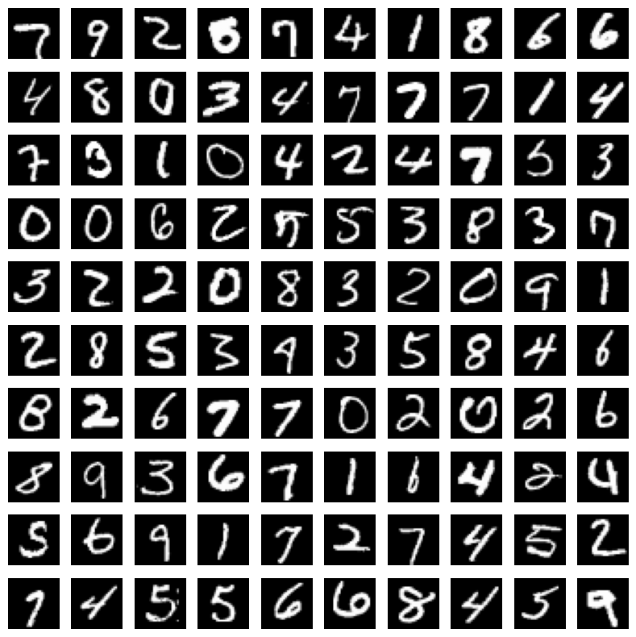
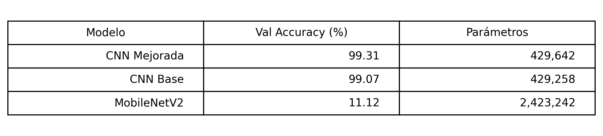
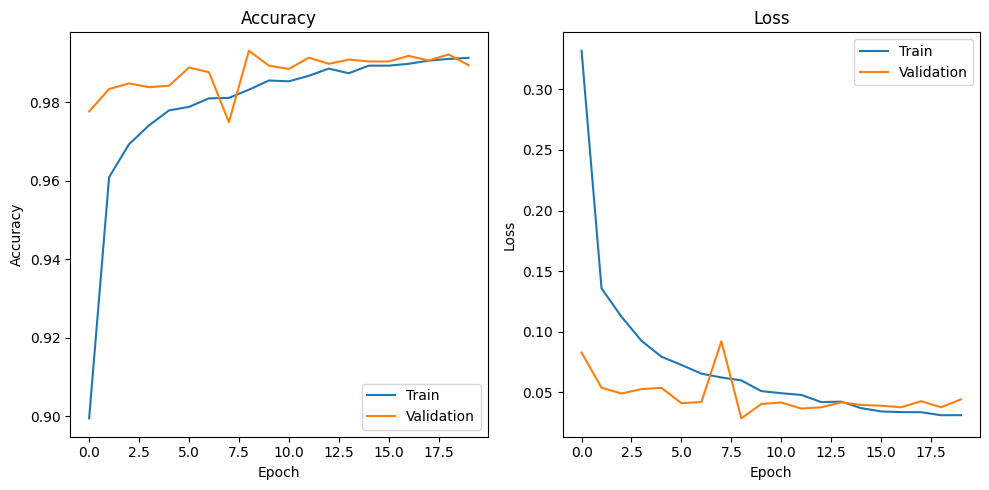

# 🔢 Digit Recognizer with Deep Learning

Proyecto de Computer Vision basado en el dataset MNIST para la clasificación automática de dígitos manuscritos mediante Redes Neuronales Convolucionales (CNN).

El objetivo del proyecto es comparar distintas arquitecturas de Deep Learning, evaluar su capacidad de generalización y analizar el impacto de técnicas de regularización y transferencia de aprendizaje.

---

## 📌 Objetivos

- Construir un pipeline completo de clasificación de imágenes.
- Implementar modelos CNN desde cero.
- Aplicar técnicas de regularización.
- Evaluar el impacto del Data Augmentation.
- Analizar la viabilidad del Transfer Learning en datasets simples.
- Comparar rendimiento, complejidad y capacidad de generalización.

---

## 🗂 Dataset

Se utiliza el dataset **MNIST** de dígitos manuscritos, disponible a través de la competición Kaggle Digit Recognizer.

Características:

- 42.000 imágenes de entrenamiento
- 28.000 imágenes de test
- Escala de grises
- Resolución 28x28 píxeles
- 10 clases (dígitos del 0 al 9)

---

## 🖼 Ejemplos del dataset



---

# 🔬 Pipeline del proyecto

El proyecto implementa un flujo completo de Deep Learning:

1. Descarga y carga del dataset
2. Exploración de datos
3. Preprocesamiento y normalización
4. Construcción de modelos
5. Entrenamiento
6. Evaluación
7. Comparación de arquitecturas
8. Generación de predicciones para Kaggle

---

# 🏗 Modelos implementados

## 1. CNN Base

Arquitectura convolucional sencilla:

- Conv2D
- MaxPooling
- Dense Layers
- Dropout

Objetivo:

Establecer una línea base de rendimiento.

---

## 2. CNN Mejorada

Extensión de la arquitectura anterior mediante:

- Batch Normalization
- Data Augmentation
- Ajuste de regularización

Técnicas aplicadas:

- Random Rotation
- Random Zoom
- Dropout

Objetivo:

Mejorar la capacidad de generalización y reducir el sobreajuste.

---

## 3. Transfer Learning (MobileNetV2)

Implementación experimental utilizando:

- MobileNetV2 preentrenado en ImageNet
- Clasificador personalizado
- Fine-tuning limitado

Resultado:

El rendimiento fue inferior al obtenido con las CNN diseñadas específicamente para MNIST.

Este resultado confirma que el Transfer Learning no siempre es la mejor opción para datasets pequeños y muy diferentes del dominio ImageNet.

---

# 📈 Resultados

## Comparativa visual



---

## Curvas de entrenamiento (CNN mejorada)



---

# 🧠 Conclusiones

- La CNN Mejorada obtuvo el mejor rendimiento global.
- Batch Normalization mejoró la estabilidad del entrenamiento.
- Data Augmentation aportó una mejora moderada.
- MobileNetV2 mostró un rendimiento inferior pese a tener muchos más parámetros.
- Para imágenes pequeñas (28×28), una CNN diseñada específicamente para el problema resulta más eficiente que un modelo preentrenado sobre ImageNet.
---

# 🚀 Posibles mejoras futuras

- Implementación de ResNet para imágenes pequeñas.
- Ensemble de modelos CNN.
- Hyperparameter Tuning automatizado.
- Uso de Optuna o KerasTuner.
- Exportación a TensorFlow Lite.
- Despliegue mediante API REST.

---

# ♻️ Reproducibilidad

Instalar dependencias:

```bash
pip install -r requirements.txt
```

Ejecutar:

```bash
jupyter notebook digit_recognizer.ipynb
```

---

# 📁 Estructura del proyecto

```text
digit-recognizer-deep-learning/
│
├── digit_recognizer.ipynb
├── README.md
├── requirements.txt
│
└── images/
    ├── sample_digits.png
    ├── training_curves.png
    └── model_comparison.png
```

---

# 👨‍💻 Autor

Luis Pastor Nuevo

---

# ⭐ Nota

Proyecto orientado a portfolio profesional de Machine Learning y Computer Vision, mostrando experimentación sistemática, evaluación comparativa de arquitecturas y buenas prácticas en Deep Learning.