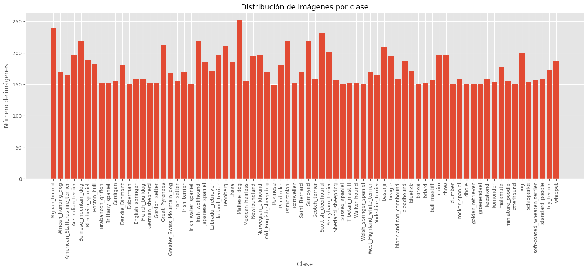
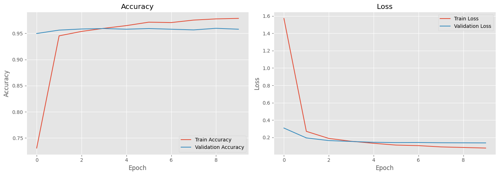
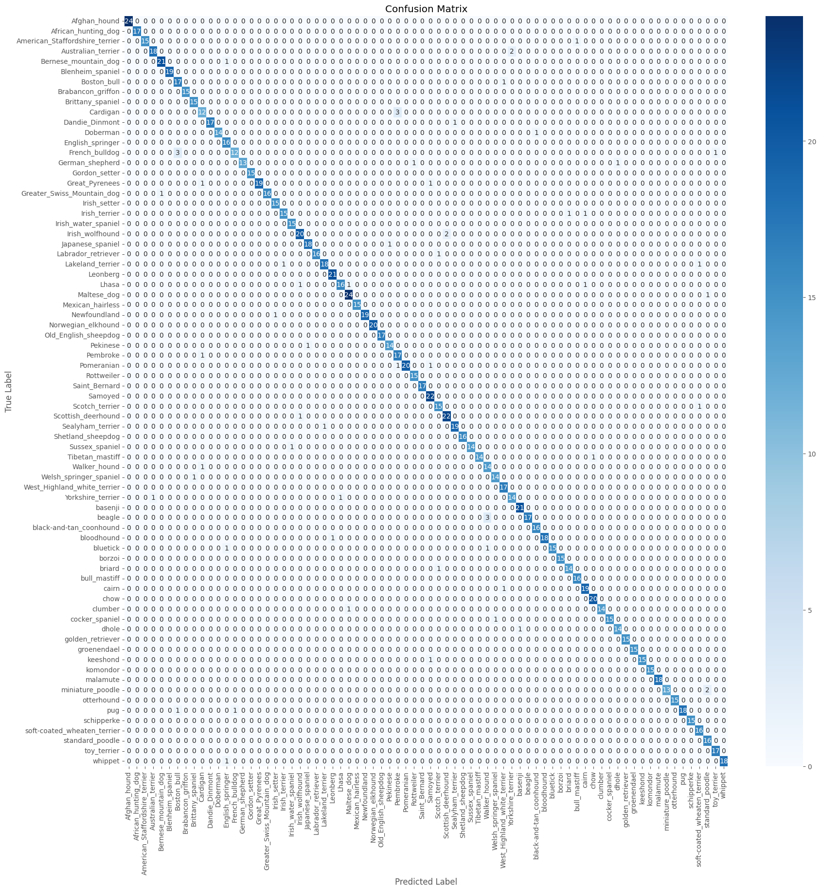

# 🐶 Clasificación de Razas de Perros con Deep Learning

Proyecto de *Computer Vision* y *Deep Learning* orientado a la clasificación multiclase de razas de perros utilizando TensorFlow/Keras.  
Se comparan distintos enfoques de modelado, desde redes simples hasta *Transfer Learning* con modelos preentrenados.

---

# 🎯 Objetivo del proyecto

El objetivo de este proyecto es analizar y comparar diferentes estrategias de clasificación de imágenes para evaluar su impacto en el rendimiento final del modelo.

Se implementan los siguientes enfoques:

- Modelo baseline (red completamente conectada)
- CNN entrenada desde cero
- CNN con regularización (Dropout)
- Data Augmentation
- Transfer Learning con InceptionV3
- AutoML con AutoKeras

---

# 📊 Dataset

- Dataset: Dog Breed Classification
- Fuente: Hugging Face

🔗 https://huggingface.co/datasets/lpastor75/dog-breed-classification

- Más de 12.000 imágenes
- 74 razas de perros
- Clasificación multiclase

El dataset se descarga automáticamente mediante `huggingface_hub`.

---

# 🧠 Tecnologías utilizadas

- Python
- TensorFlow / Keras
- AutoKeras
- NumPy
- Pandas
- Matplotlib
- Seaborn
- Scikit-learn
- Hugging Face Hub

---

# 📁 Estructura del proyecto

```bash
dog-breed-classification/
│
├── dog_breed_classification.ipynb
├── README.md
└── images/
    ├── class_distribution.png
    ├── confusion_matrix.png
    ├── training_curves.png
```

## 🔬 Pipeline del proyecto

El proyecto implementa un flujo completo de Deep Learning:

- Descarga automática del dataset  
- Exploración y visualización de datos  
- Preprocesamiento de imágenes con `tf.data`  
- Entrenamiento de múltiples arquitecturas  
- Evaluación con métricas y matrices de confusión  
- Comparativa de modelos  
- Visualización de resultados  

---

## 🏗️ Modelos implementados

### 1. Modelo baseline

Red completamente conectada utilizada como punto de referencia.

- Flatten + Dense + Softmax  
- Bajo rendimiento  
- Problemas de underfitting  

---

### 2. CNN desde cero

Arquitectura convolucional tipo VGG.

- Conv2D + MaxPooling  
- Dense layers  
- Mejora significativa respecto al baseline  
- Aparición de sobreajuste  

---

### 3. CNN con regularización

Mejora del modelo anterior mediante:

- Dropout  
- Mayor profundidad  

Objetivo: reducir overfitting y mejorar generalización.

---

### 4. Data Augmentation

Técnicas aplicadas:

- Random Flip horizontal  
- Random Contrast  

Objetivo: aumentar la robustez del modelo y mejorar generalización.

---

### 5. Transfer Learning (InceptionV3)

Modelo preentrenado sobre ImageNet.

- Base congelada  
- Clasificador personalizado  
- Dropout para regularización  

✔ Mejor rendimiento global  
✔ Mejor generalización  
✔ Convergencia más rápida  

---

## 📊 Distribución de clases



## 📉 Curvas de entrenamiento (InceptionV3)


Este resultado corresponde al modelo InceptionV3 con transfer learning.

## 🔥 Matriz de confusión (InceptionV3)


Este resultado corresponde al modelo InceptionV3 con transfer learning.


## 📈 Resultados comparativos

| Modelo | Rendimiento |
|--------|------------|
| Baseline | Bajo |
| CNN básica | Medio |
| CNN + Dropout | Medio-alto |
| Data Augmentation | Medio-alto |
| AutoKeras | Variable |
| Transfer Learning (InceptionV3) | ⭐ Mejor resultado |

---


## 🧾 Conclusiones

- Transfer Learning es el enfoque más efectivo para este problema.  
- Las CNN desde cero requieren más datos para generalizar correctamente.  
- Data Augmentation ayuda, pero no sustituye modelos preentrenados.  
- AutoML no fue competitivo con pocos trials.  

---

## 🚀 Posibles mejoras futuras

- Fine-tuning de InceptionV3  
- Uso de EfficientNet o ConvNeXt  
- Exportación a TensorFlow Lite  
- Deploy con API REST o Streamlit  
- Optimización para inferencia en tiempo real  

---

## ♻️ Reproducibilidad

El proyecto incluye:

- Semillas aleatorias fijadas  
- Descarga automática del dataset  
- Instalación de dependencias  
- Pipeline reproducible con `tf.data`  

---

## 👨‍💻 Autor

Proyecto desarrollado por: **Luis Pastor Nuevo**

---