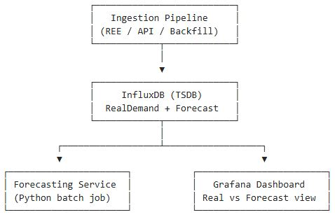
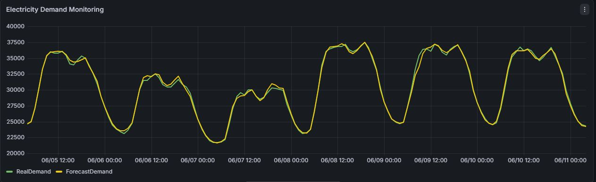
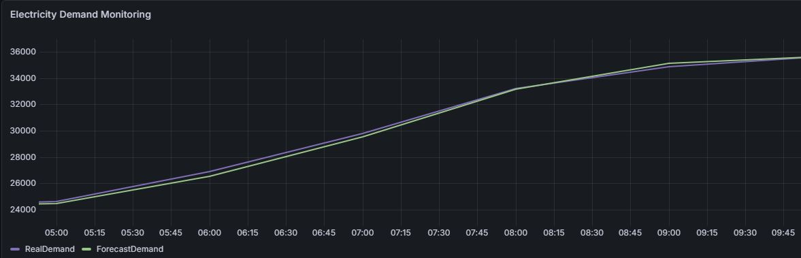
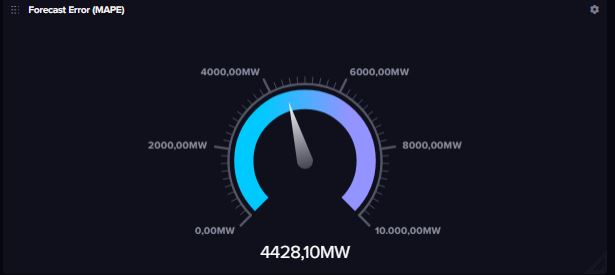

# ⚡ Demanda Eléctrica en España — Pipeline de Datos + Forecasting (REE + InfluxDB + ML)

## 📌 Descripción del proyecto

Este proyecto implementa un sistema completo de **ingesta de datos, almacenamiento en series temporales y predicción de demanda eléctrica en España**, utilizando datos públicos de la Red Eléctrica Española (REE).

El objetivo es construir una arquitectura realista de ingeniería de datos que incluya:

- Ingesta automática de datos energéticos
- Almacenamiento en base de datos de series temporales (InfluxDB)
- Pipeline de backfill histórico (2022 → actualidad)
- Modelo de predicción de demanda eléctrica
- Publicación de predicciones en InfluxDB
- Visualización en dashboards (Grafana)

---

## 🏗️ Arquitectura del sistema

### 🔷 Pipeline completo (ingesta + almacenamiento + visualización)

Este diagrama muestra la arquitectura end-to-end del sistema, desde la ingesta de datos hasta su visualización en dashboards.


---

### 🔶 Pipeline de forecasting (modelo predictivo)

Este segundo diagrama detalla exclusivamente la capa de machine learning encargada de la predicción de demanda eléctrica.

Incluye:

- Preparación de datos desde InfluxDB
- Generación de features (lags temporales)
- Entrenamiento del modelo de forecasting
- Generación de predicciones horarias
- Escritura de `ForecastDemand` en InfluxDB
- Consumo de resultados en Grafana



Este pipeline se ejecuta de forma incremental y permite generar predicciones horarias en tiempo casi real.

---

## 🔄 Arquitectura general del pipeline

El sistema se divide en dos bloques principales:

### 1. Pipeline de ingesta (Notebook 1)

Se encarga de:

- Extracción de datos desde la API de REE
- Limpieza y normalización de timestamps
- Almacenamiento en InfluxDB
- Backfill completo (histórico desde 2022)
- Evitar duplicados mediante control de timestamps

---

### 2. Pipeline de forecasting (Notebook 2)

Se encarga de:

- Lectura de datos desde InfluxDB
- Preparación de variables temporales (lags)
- Entrenamiento de modelo de machine learning
- Generación de predicciones horarias
- Publicación de resultados en InfluxDB

---

## 💾 Almacenamiento de datos (InfluxDB)

Se utiliza InfluxDB como base de datos de series temporales.

### Measurement principal:

- `demand`

### Campos:

| Campo          | Descripción                  |
|----------------|------------------------------|
| RealDemand     | Demanda eléctrica real       |
| ForecastDemand | Predicción del modelo        |

---

## 🧠 Sistema de predicción (Notebook 2)

### Modelo utilizado

- Algoritmo: `RandomForestRegressor`
- Variables de entrada:
  - `lag_1`  → valor de la hora anterior
  - `lag_24` → valor de la misma hora del día anterior

### Salida del modelo

- Predicción de demanda horaria

### Horizontes de predicción

- 24 horas (operación diaria)
- 7 días (planificación semanal)

---

## 🔁 Pipeline de backfill

El sistema permite:

- Detectar automáticamente el último dato almacenado
- Continuar la ingesta desde ese punto
- Evitar duplicación de datos
- Ejecutar backfill completo desde 2022

Esto garantiza integridad total de la serie temporal.

---

## 📊 Visualización en Grafana

El sistema está diseñado para integrarse con **Grafana conectado a InfluxDB**.

### Capacidades del dashboard:

- Monitorización en tiempo real de la demanda
- Comparación entre demanda real y predicción
- Análisis de patrones temporales
- Detección visual de desviaciones del modelo



---

## 📈 Comparación: Real vs Predicción




---

## ⚙️ Características principales

- Pipeline completo de datos de energía
- Arquitectura tipo producción
- Modelo de machine learning para forecasting
- Backfill automático y seguro
- Integración con base de datos de series temporales
- Visualización en dashboards profesionales

---

## 🧪 Evaluación del modelo

El rendimiento del modelo se evalúa mediante:

- MAE (Error Absoluto Medio)
- Validación mediante ventanas temporales (rolling windows)

Esto permite medir la estabilidad del modelo en distintos periodos.

---

## 🧰 Tecnologías utilizadas

- Python
- Pandas / NumPy
- Scikit-learn
- InfluxDB (base de datos de series temporales)
- Flux Query Language
- Grafana
- Matplotlib (solo exploración)
- Jupyter Notebooks

---

## 🚀 Cómo ejecutar el proyecto

### 1. Instalar dependencias

```bash
pip install -r requirements.txt
```

### 2. Configurar variables de entorno

Crear un archivo .env:

INFLUX_TOKEN=tu_token
INFLUX_URL=tu_url
INFLUX_ORG=tu_org
INFLUX_BUCKET=tu_bucket

### 3. Ejecutar pipeline de ingesta

```bash
jupyter notebook 01_data_ingestion_electric_demand.ipynb
```

### 4. Ejecutar pipeline de forecasting

```bash
jupyter notebook 02_energy_demand_forecasting.ipynb
```

## 📁 Estructura del proyecto

```text
.
├── ingestion_pipeline.ipynb
├── energy_demand_forecasting.ipynb
├── requirements.txt
├── images/
│   ├── architecture_overview.png
│   ├── grafana_dashboard_overview.png
│   ├── forecast_vs_real.png
│   └── influxdb_query_example.png
└── README.md
```

---

## ⚡ Caso de estudio: apagón eléctrico (28/04/2025)

Este conjunto de visualizaciones muestra el comportamiento del sistema de monitorización y forecasting durante un evento real de alta relevancia operativa: la interrupción eléctrica que afectó a gran parte de España el 28 de abril de 2025.

Este caso se utiliza como **validación histórica del pipeline de datos**, permitiendo analizar cómo el sistema captura anomalías en la demanda eléctrica y cómo se comportan las predicciones frente a eventos extremos.

---

### 📊 Dashboard de monitorización (InfluxDB)

Vista general del comportamiento del sistema durante el evento.


---

### 📉 Evolución de la demanda eléctrica

Serie temporal de la demanda real durante el periodo del evento, donde se observa una caída significativa respecto al patrón habitual.


---

### 📊 Comparación entre demanda real y predicción

Comparativa entre la demanda observada y la predicción oficial del sistema (ForecastDemand vs RealDemand).


---

### ⚠️ Error de predicción

Visualización del error entre demanda real y prevista, utilizada para evaluar la calidad del modelo durante eventos anómalos.


---

### 📈 Indicador agregado de error

Métrica agregada utilizada para monitorizar el rendimiento global del sistema de forecasting durante el evento.



---

### 🧠 Observaciones

El evento del 28/04/2025 permite validar el comportamiento del sistema en condiciones no estacionarias.

Se observa:

- Desviación significativa entre predicción y realidad durante el evento.
- Capacidad del sistema para seguir capturando patrones generales tras la anomalía.
- Utilidad del enfoque basado en series temporales para monitorización operativa.

Este caso refuerza el valor del pipeline no solo como sistema de forecasting, sino como herramienta de **observabilidad energética en tiempo real**.
---

## 👤 Autor

**Luis Pastor Nuevo**

Analista de Datos | Data Engineer | Data Scientist

Especializado en:

- Sistemas de series temporales
- Pipelines de datos en energía
- Modelos de forecasting
- Arquitecturas con InfluxDB + Grafana

---

## 📄 Licencia

Este proyecto se publica con fines educativos y de portfolio profesional.

El código puede utilizarse como referencia técnica o base de aprendizaje.

