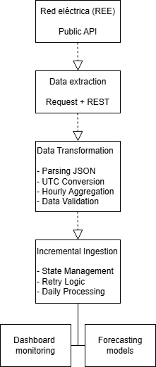
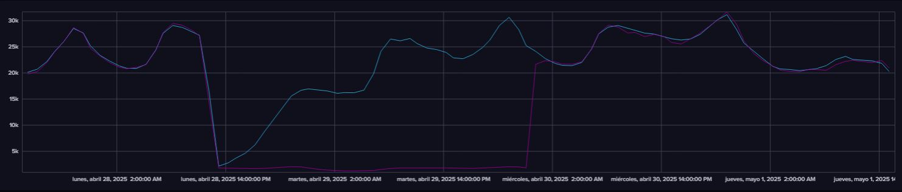
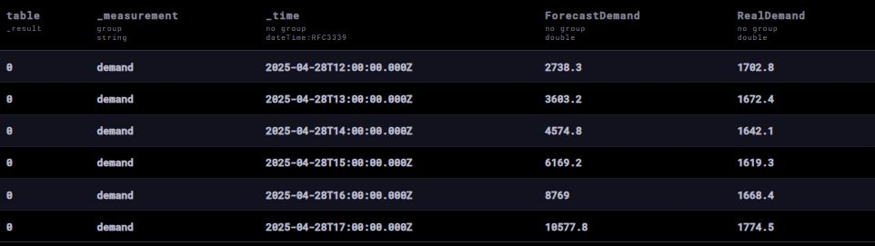
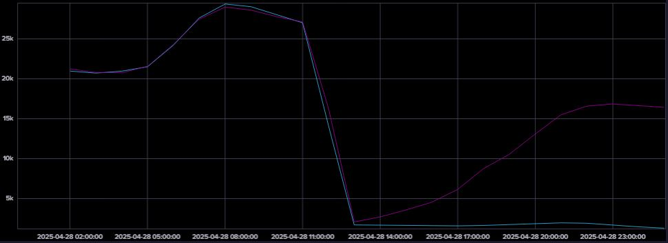
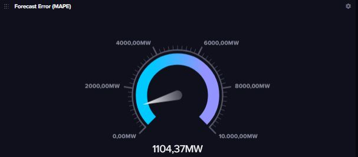

# ⚡ Electricidad en España — Pipeline de Ingesta y Análisis de Demanda Energética

## 📌 Descripción del proyecto

Este proyecto implementa un pipeline completo de **ingesta, almacenamiento y análisis de datos de demanda eléctrica en España**, utilizando la API pública de Red Eléctrica Española (REE) y una base de datos de series temporales en InfluxDB.

El objetivo es simular un entorno real de ingeniería de datos, donde los datos se ingieren de forma continua, se almacenan en una base de datos temporal y se preparan para su análisis y visualización.

---

## 🏗️ Arquitectura del sistema



---

## 🧹 Procesamiento de datos

Los datos se transforman para:

- Normalización de timestamps a UTC
- Agregación horaria de la serie temporal
- Estructuración en formato tabular

Variables finales:

- `RealDemand` → consumo eléctrico real
- `ForecastDemand` → predicción oficial de REE

---

## 💾 Almacenamiento

Se utiliza **InfluxDB** como base de datos de series temporales.

- Measurement: `demand`
- Fields:
  - `RealDemand`
  - `ForecastDemand`

Esto permite consultas eficientes sobre series temporales y visualización en dashboards.

---

## 🔁 Pipeline de ingesta

El sistema implementa un pipeline incremental con las siguientes características:

- Detecta automáticamente el último timestamp almacenado en InfluxDB
- Reanuda la ingesta desde ese punto
- Evita reprocesamiento de datos ya almacenados
- Permite ejecución continua (modo streaming batch)

---

## 📈 Visualización

Los datos pueden analizarse mediante dashboards en InfluxDB:

- Serie temporal de demanda eléctrica
- Comparación entre demanda real y predicción
- Análisis por días o rangos temporales
- Métricas derivadas como error entre predicción y realidad

---

## 📊 Resultados

Una vez completada la ingesta, los datos quedan almacenados en InfluxDB y pueden ser consultados y monitorizados mediante dashboards de series temporales.

Las siguientes visualizaciones corresponden al evento de interrupción eléctrica que afectó a gran parte de España el **28 de abril de 2025**.

Este evento constituye un caso de especial interés desde el punto de vista analítico, ya que permite observar una alteración significativa en los patrones habituales de demanda eléctrica y validar la capacidad del pipeline para capturar eventos operacionales relevantes en tiempo real.

### Dashboard de monitorización

Vista general del dashboard construido sobre InfluxDB para la supervisión de la demanda eléctrica española.



---

### Evolución de la demanda eléctrica

Serie temporal de demanda eléctrica durante el periodo analizado. Puede apreciarse la alteración del comportamiento habitual asociada al evento del 28 de abril de 2025.



---

### Comparación entre demanda real y demanda prevista

Comparativa entre la demanda registrada y la demanda pronosticada por Red Eléctrica de España (REE).



---

### Indicador de error de predicción

Métrica calculada a partir de la diferencia entre la demanda real y la demanda prevista, utilizada para monitorizar el comportamiento del sistema de predicción.



---

### Observaciones

El evento de interrupción eléctrica registrado en España el **28 de abril de 2025** aparece reflejado en la serie temporal mediante una caída significativa de la demanda.

Este caso permite ilustrar cómo una arquitectura basada en series temporales puede utilizarse para:

- Monitorización energética en tiempo real.
- Detección de anomalías.
- Análisis de eventos operacionales.
- Desarrollo de modelos de forecasting.
- Construcción de cuadros de mando para observabilidad de sistemas energéticos.

---

## 🧠 Tecnologías utilizadas

- Python
- Pandas
- Requests
- InfluxDB Cloud / OSS
- Flux Query Language
- Matplotlib (exploración)
- Jupyter Notebook

---

## ⚙️ Configuración

El proyecto utiliza variables de entorno para almacenar credenciales de acceso a InfluxDB.

Crear un archivo `.env` con la siguiente estructura:

```env
INFLUX_TOKEN=your_influxdb_token
```

Por seguridad, este archivo no debe subirse al repositorio.

## 🚀 Cómo ejecutar el proyecto

### 1. Instalar dependencias

```bash
pip install -r requirements.txt
```

### 2. Configurar variables de entorno

```bash
INFLUX_TOKEN=your_token_here
```

### 3. Ejecutar Jupyter Notebook

```bash
jupyter notebook
```

## 📌 Resultado final

Este proyecto permite:

- Ingesta automatizada de datos energéticos desde la API de Red Eléctrica Española (REE)
- Almacenamiento en una base de datos de series temporales (InfluxDB)
- Reanudación incremental del pipeline directamente desde la base de datos
- Visualización del consumo eléctrico real en España en tiempo casi real
- Comparación entre demanda real (`RealDemand`) y predicción oficial (`ForecastDemand`)
- Análisis temporal de la evolución de la demanda eléctrica

---

## 👤 Autor

**Luis Pastor Nuevo**

Data Analyst | Data Scientist | Data Engineer

Proyecto orientado al diseño de pipelines de datos, almacenamiento de series temporales y analítica aplicada sobre datos energéticos.
---

## 📄 Licencia

Este repositorio se comparte con fines demostrativos y de portfolio profesional.

El código y la documentación pueden utilizarse como referencia educativa o técnica.

No se ofrece ninguna garantía sobre su adecuación para entornos productivos.